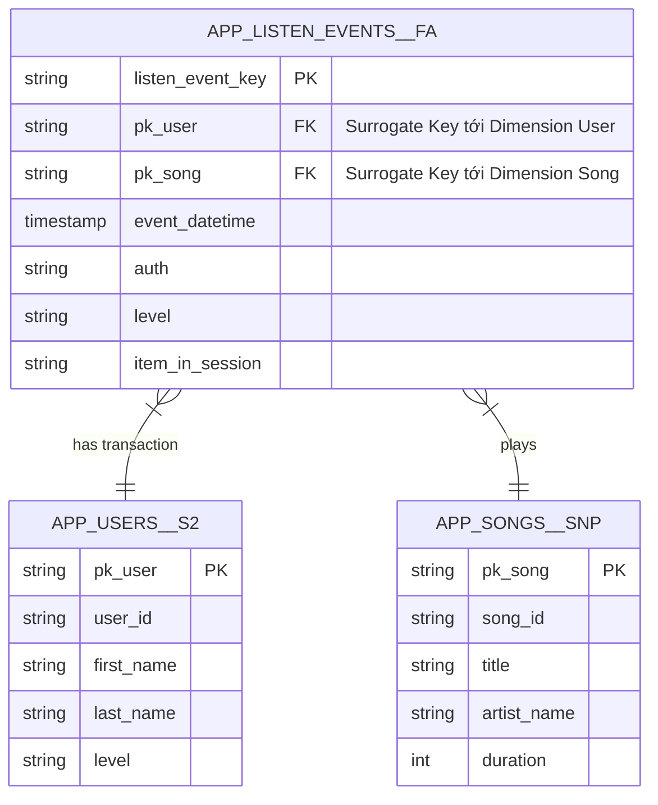

# Tài Liệu Kỹ Thuật (Technical Documentation) - Data Pipeline

## 1. Tổng Quan Kiến Trúc (Architecture Overview)

Hệ thống Data Pipeline này được thiết kế dựa trên kiến trúc **Lambda/Kappa (tùy thuộc vào thiết lập)** để xử lý, vận chuyển và biến đổi lượng lớn dữ liệu sự kiện (event data) dạng streaming hoặc batch. Mục tiêu chính là xây dựng một luồng dữ liệu end-to-end có khả năng mở rộng từ các nguồn phát sinh dữ liệu (Source) đến hệ thống phân tích cuối cùng.

Luồng dữ liệu tổng quát:
1. **Source (Eventsim & Location/Songs)**: Hệ thống giả lập sự kiện sinh ra các log tương tác của người dùng.
2. **Kafka (Ingestion/Message Broker)**: Nhận và đệm dữ liệu sự kiện theo thời gian thực thành các Topic khác nhau (page view, listen, auth, v.v.).
3. **Spark Streaming (Data Processing - Extract & Light Transform)**: Tiêu thụ dữ liệu từ Kafka, thực hiện các bước làm sạch sơ bộ (ép kiểu, loại bỏ dữ liệu sai lệch) và ghi liên tục dưới định dạng Parquet/JSON vào **Google Cloud Storage (GCS) Data Lake**.
4. **Airflow (Orchestration & Load)**: Đóng vai trò là hệ thống điều phối, quản lý dependency và lập lịch cho toàn bộ pipeline. Airflow sẽ gọi các tác vụ để Load dữ liệu (L) từ GCS vào **Google BigQuery**.
5. **dbt (Data Transformation - T)**: Đọc dữ liệu Raw/Staging, thực hiện biến đổi dữ liệu nghiệp vụ nặng (Transform) ngay bên trong BigQuery để xây dựng Data Warehouse (Marts).

### Sơ Đồ Kiến Trúc Hệ Thống

```mermaid
flowchart LR
    subgraph Data Sources
        E(Eventsim)
        LS(Locations & Songs)
    end

    subgraph Streaming & Message Broker
        K[Kafka Cluster]
    end

    subgraph Data Processing
        S[Apache Spark Streaming]
    end

    subgraph Data Lake
        GCS[(Google Cloud Storage)]
    end

    subgraph Data Warehouse
        BQ[(Google BigQuery)]
    end

    subgraph Data Transformation
        D[dbt]
    end

    subgraph Orchestration
        A((Apache Airflow))
    end

    E -->|Producing Events| K
    LS -->|Flat files| GCS
    K -->|Consuming Topics| S
    S -->|Write files (Parquet/JSON)| GCS
    GCS -->|Load/External Tables| BQ
    BQ -->|Raw Data| D
    D -->|Transform/Marts| BQ
    
    A -.->|Trigger & Monitor| S
    A -.->|Load GCS to BQ| BQ
    A -.->|Trigger dbt runs| D
```

---

## 2. Chi Tiết Các Thành Phần (Component Details)

### 2.1. Kafka (Ingestion Layer / Message Broker)
**Thư mục**: `streaming/kafka/`
* **Vai trò & Giải pháp:**
Trong thực tế, lưu lượng phát sinh sự kiện (traffic burst) của người dùng thường không đồng nhất. Apache Kafka được sử dụng làm **bộ đệm phân tán (Distributed Buffer)** nhằm tách rời (decouple) phía phát dữ liệu (Producer/Eventsim) và hệ thống xử lý (Spark Streaming). Thiết kế này giúp đảm bảo tính chịu lỗi (Fault-tolerance), khả năng mở rộng cực cao, và ngăn ngừa hệ thống phía đằng sau (downstream) bị nghẽn (bottleneck), đồng thời cho phép khôi phục hay trích xuất lại log khi hệ thống trục trặc.
* **Chi Tiết Setup:**
EventSim kết nối như Producer đẩy trực tiếp các thông điệp có định dạng JSON vào **các Topic riêng biệt** thay vì gom cụm: `listen_events`, `auth_events`, `page_view_events`, `status_change_events` và `user_info`. Việc phân chia rành mạch Topic cho phép cấu hình phân tán tiểu lô (Micro-batching) ở phía Spark được độc lập và song song hoàn toàn.

### 2.2. Apache Spark Streaming (Extract & Light Transform)
**Thư mục**: `streaming/spark_streaming/`
* **Vai trò:** Vận hành phần Extract (E) và transform siêu nhẹ (t) ở mô hình EtLT. Tận dụng công nghệ **Structured Streaming** xử lý các luồng thời gian thực thành Micro-batch, biến đổi dữ liệu phi cấu trúc và lưu vào Data Lake.
* **Logic Xử Lý (`stream_all_events.py` & `streaming_functions.py`)**:
  1. **Khởi tạo & Offset Control**: Thiết lập Kafka consumer độc lập thông qua việc tự động gen ID (UUID cho Consumer Group `SPARK_RUN_ID`), kèm cờ `startingOffsets="earliest"`. Cách tiếp cận này đảm bảo mọi message cũ đều được lôi ra đọc từ đầu mỗi khi run job mới.
  2. **Parsing & Ép kiểu định quy (Schema on Read)**: Dữ liệu tải payload từ cột `value` định dạng binary được đẩy qua hàm `from_json`. Nó đi kèm schema định nghĩa rạch ròi bằng `StructType` (`schema.py`). Giải pháp ép kiểu gắt gao ngay từ đầu "khai xuất" (Data Integrity) này giúp chặn dữ liệu rác lan tràn vào Data Lake.
  3. **Tiền Xử Lý Nhẹ (Light Cleansing)**:
    - Loại bỏ ngay lập tức các Records thiểu năng (ví dụ null `userId`, `sessionId`).
    - Chuyển cấu trúc Timestamp chuẩn: Chia Timestamp Epoch (milliseconds) cho 1000 và Parse định dạng thành `TimestampType` thuần túy để hỗ trợ BigQuery query sau này.
  4. **Ghi và Dự phòng Sự Cố (Clean Sink & Checkpointing)**: 
    - Đổ file vật lý (Sink) như JSON / Parquet vào trung gian **Google Cloud Storage (GCS)** thay vì đập vào DB theo trigger batch (vd: 60s). 
    - Ghi log bù đắp liên tục tại thư mục Checkpoint `gs://.../checkpoint`. Do đó Spark instance có quyền crash bất cứ lúc nào, nó sẽ tự lôi file check này ra và resume luồng tiêu thụ theo logic *Exactly-Once semantics*.

### 2.3. dbt - Data Build Tool (Transformation)
**Thư mục**: `orchestration/dbt/`

**Vai trò & Giải pháp:**
Trong mô hình EtLT, BigQuery đóng vai trò là "Cơ bắp tính toán" (MPP Database), và **dbt** đóng vai trò là "Bộ não". dbt áp dụng phương pháp Software Engineering (như Git Version Control, CI/CD, Documentation, Testing) vào trong luồng xử lý SQL. Điểm nổi bật ở dự án này là việc tổ chức dbt tuân thủ quy ước đặt tên (naming conventions) chặt chẽ bằng các hậu tố (suffixes) để quản lý loại bảng dữ liệu: `__fa` (Fact Append), `__fu` (Fact Update), `__snp` (Snapshot), và `__s2` (Slowly Changing Dimension Type 2).

**Chi Tiết Cấu Trúc Các Lớp (Layers):**
* **Lớp Nguồn (`models/sources.yml`, `external_tables.yml`)**: Định nghĩa trực tiếp các External Tables được ánh xạ từ thư mục chứa file Parquet/JSON trên Data Lake (GCS). Qua đó dbt có thể đọc và tham chiếu trực tiếp bằng hàm `{{ source('ext_data_staging', '...') }}` nhờ tích hợp `dbt-external-tables`.
* **Lớp Staging (`models/staging/`)**: Không phải để tinh chỉnh nghiệp vụ, mà dùng để dọn dẹp các "nợ kỹ thuật" (Technical Debt) trước khi lưu vào Data Warehouse. Thực hiện rename định dạng (snake_case), cắt chuỗi thừa (Trim), cast định danh dữ liệu, và đặc biệt là Deduplication (lọc trùng). Sử dụng các bảng tiêu biểu có tiền tố `stg_` như `stg_listen_events__fa` hay `stg_users__fu`.
* **Lớp Core (`models/core/`)**: Nơi chứa đựng logic nghiệp vụ theo mô hình Star Schema lõi toàn cục hệ thống.
  - **Dimension Tables**: Chứa Master Data và lưu trạng thái lịch sử. Ví dụ bảng `app_users__s2` sử dụng tính năng snapshot của dbt để quản lý Type 2 SCD giữ log người dùng đổi tier, hoặc `app_songs__snp`.
  - **Fact Tables**: Lưu dấu vết sự kiện chi tiết: `app_listen_events__fa` (sự kiện dạng append) hay `app_status_change_events__fu` (sự kiện cho phép update).
* **Lớp Marts (`models/marts/`)**: Tầng Business Intelligence (Data Mart) phục vụ truy vấn hoặc báo cáo trực tiếp.
  - Tích hợp các bảng tổng hợp Fact (`f_user_daily_activity`, `f_song_daily_performance`) và thẻ điểm User hoàn thiện (`d_user_profile`).
  - Cung cấp sẵn các bảng Aggregate Summary (như `smy_session_quality_analysis__mnp`, `smy_user_behavior_daily__mnp`) cho Team Analyst tính toán nhanh.
* **Hỗ trợ Automation & Testing (Macros/Yml)**: Tái sử dụng logic SQL rải rác nhờ Jinja templating (`dbt/macros/normalize_song_name.sql`, `standardise_postal_code.sql`). Kết hợp schema testing ràng buộc với dbt (chẳng hạn kiểm tra `not_null`, `unique`, `relationships`) trực tiếp tại các file `.yml` để chăn chặn rác Data lọt qua pipeline lõi.

### 2.4. Apache Airflow (Orchestration & Data Loading)
**Thư mục**: `orchestration/airflow/`

**Vai trò & Giải pháp:**
Airflow là trái tim điều phối toàn bộ các tiến trình Data tĩnh (Batch) cũng như Stream phụ trợ trong hệ thống (Orchestrator). Nó loại bỏ sự phụ thuộc thủ công vào lệnh Cron truyền thống bằng cách đóng gói các dependencies thành Directed Acyclic Graphs (DAGs) dễ dàng monitor trực quan qua Web UI, đi kèm với đó là khả năng alerting và auto-retries khi pipeline gãy vòng.

**Chi Tiết Các Tập Lệnh (DAGs) Thiết Kế:**
* **Luồng Load Batch Data (`load_dims_from_gcs_dag.py`, `load_songs_dag.py`)**: Đảm nhiệm việc bốc (load) dữ liệu thông tin User (json) hoặc Song catalog/Location (csv/parquet) thành các Table tĩnh lên BigQuery bằng Sensor và Transfer Operator.
* **Luồng Load Streaming Reference (`load_events_producers.py`)**: Kích hoạt việc liên kết/mở khóa các tác vụ ghi dữ liệu events Kafka-Spark vào hạ tầng BigQuery lưu trữ.
* **Tích hợp dbt qua Astronomer Cosmos (`dbt_cosmos_dag.py`, `dbt_transformation_consumer.py`)**: Đây là điểm sáng kiến trúc mạnh mẽ. Thay vì cho Airflow trigger chạy toàn bộ một cục `dbt run` bằng `BashOperator`, hệ thống sử dụng module Cosmos để render **mỗi model dbt thành một Task riêng biệt trên giao diện Airflow**. 
  - *Tại sao lại chọn cấu trúc này?* Khi hệ thống có hàng chục bảng dbt liên kết chằng chịt, nếu một bảng Staging hỏng, Airflow Cosmos cho phép Retry chính xác tại duy nhất Task lỗi đó trên UI mà không cần chạy lại toàn dbt project. Cực kỳ tối ưu khi handle SLA cho Data.

---

## 3. Data Schema & Phần Phân Tích Logic Code dbt (SQL)

Hệ thống Warehouse được chia tầng theo chuẩn kiến trúc Data Vault/Star Schema để phục vụ BI và Reporting. Các logic biến đổi dữ liệu (Transformations) lõi chịu trách nhiệm duy trì tính toàn vẹn (Data Integrity) trên chuỗi dữ liệu Stream liên tục.

### Mô Tả Các Tầng Dữ Liệu (Data Layers)

| Tên Bảng (dbt Model) | Naming Convention | Lớp (Layer) | Giải Thích Vai Trò (Purpose) |
|---|---|---|---|
| `stg_listen_events__fa`, `stg_users__fu` | `stg_` | **Staging** | Dữ liệu thô (raw) đã được xử lý "nợ kỹ thuật" cơ bản (Type cast, snake_case trim, drop null). |
| `app_users__s2`, `app_songs__snp` | `__s2`, `__snp` | **Core (Dim)** | Dimension master data. `__s2` hỗ trợ SCD Type 2 lưu lịch sử người dùng đổi Tier. `__snp` hỗ trợ Snapshot data. |
| `app_listen_events__fa` | `__fa` (Fact Append) | **Core (Fact)** | Lưu trữ chuỗi sự kiện Transaction append liên tục sinh ra bởi user. Liên kết với Dimension bằng surrogate keys. |
| `f_user_daily_activity` | `f_` | **Marts (Fact)** | Dữ liệu Mart Fact tổng hợp sẵn theo grain thời gian (ví dụ ngày) phục vụ BI Dashboard. |
| `smy_user_behavior_daily__mnp` | `smy_` | **Marts (Summary)**| Bảng Summary View lưu các báo cáo dựng sẵn cho team Data Analyst tính toán. |

### Sơ Đồ Thực Thể Lớp Core (Core Layer ERD)



### Các Đoạn Logic Chuyển Đổi (Transformations) Cốt Lõi

**1. Xử lý lưu lịch sử cập nhật trạng thái (SCD Type 2 Join) tại Bảng Fact**
Dữ liệu người dùng thay đổi (ví dụ Update trạng thái từ Free lên Paid tier) được lưu lại ở lớp Core `app_users__s2`. Thay vì Join lấy `user_id` hiện tại, hệ thống bắt chuẩn xác thời điểm xảy ra sự kiện thuộc chu kỳ trạng thái nào của người dùng.
*Trích đoạn logic `app_listen_events__fa.sql`:*
```sql
    LEFT JOIN {{ ref('app_users__s2') }} AS users
      ON m.user_id = users.user_id
     -- Bắt buộc match thời điểm sự kiện nằm giữa chu kỳ mở/đóng của state User
     AND m.event_datetime >= users.row_effective_datetime
     AND m.event_datetime < users.row_expiry_datetime
```

**2. Thuật toán Loading Incremental & Tạo KHÓA PHỤ (Surrogate Key)**
Đế tối ưu BigQuery Cost, Fact lưu transactions hằng ngày không dùng lệnh `FULL REFRESH` mà apply `incremental` loading thông qua macro kiểm tra dữ liệu lớn nhất. Sau đó dùng Macro hash của dbt-utils tạo Primary Key ẩn.
*Trích đoạn logic `app_listen_events__fa.sql`:*
```sql
    
    WHERE event_datetime > (
        SELECT COALESCE(MAX(event_datetime), TIMESTAMP('1900-01-01'))
        FROM {{ this }}
    )
    
    
    -- Tạo Surrogate Key đại diện cho Event
    SELECT 
        {{ dbt_utils.generate_surrogate_key([
          'CAST(m.event_datetime AS STRING)',
          'CAST(m.user_id AS STRING)',
          'm.song',
          'm.artist'
        ]) }} AS listen_event_key,
        ...
```

**3. Khối Data Mart tự động (Aggregation/Fact Mappings)**
Bảng Mart được tạo ra để sẵn sàng "ăn liền", BigQuery sẽ tổng hợp metrics từ nhiều báo cáo trung gian thuộc khối `Summary` gom về 1 Master View (tối ưu hóa lệnh left join).
*Trích đoạn `marts/f_user_daily_activity.sql`:*
```sql
SELECT
    behavior.user_id,
    behavior.activity_date,
    COALESCE(subscription.user_subscription_segment, 'Unknown') AS subscription_segment,
    -- ...
    COALESCE(listening.total_songs_listened, 0) AS total_songs_listened,
    CASE 
        WHEN behavior.total_sessions = 0 THEN 0.0
        ELSE ROUND(behavior.next_song_clicks / behavior.total_sessions, 2)
    END AS avg_next_song_clicks_per_session
FROM behavior
LEFT JOIN listening 
    ON behavior.user_id = listening.user_id 
    AND behavior.activity_date = listening.activity_date
```

---

## 4. Vận Hành & Hướng Dẫn Thiết Lập (Operations & Setup)

Hệ thống cung cấp sẵn các công cụ **Infrastructure as Code (IaC)** để chuẩn hóa môi trường:
* **Terraform** (`terraform/main.tf`): Sử dụng để phân bổ tự động các tài nguyên Cloud (nhạy nhất là cấp phát Google Compute Engine VM, Storage Bucket, và BigQuery Dataset). Do đó chúng ta không cần click bằng tay trên UI của GCP.
* **Docker Compose**: Đóng gói môi trường local (Kafka cluster, Airflow metadata DB, scheduler, webserver).

### Các Bước Setup Cơ Bản (Dựa trên Script Khảo Sát)
1. **Thiết lập Cloud (GCP)**: Cấu hình `google_credentials.json` (Service Account Key) và gán quyền cần thiết (BigQuery Admin, Storage Admin, Compute Admin).
2. **Khởi tạo Hạ Tầng với Terraform**:
```bash
cd terraform
terraform init
terraform apply -auto-approve
```
3. **Cài Đặt Packages/Máy Ảo (VM)**: Chạy `scripts/vm_setup.sh` trên target VM để cài cắm Docker, Python dependencies.
4. **Khởi động Kafka & Spark**: `scripts/spark_setup.sh` và thiết lập Docker Compose của Kafka.
5. **Khởi động Airflow**: Khởi tạo Airflow qua `scripts/airflow_startup.sh`. Airflow UI sẽ map đến port mặc định (8080) và bắt đầu kích hoạt các DAG dbt / Ingestion theo schedule.

## Lời Kết
Kiến trúc này được thiết kế theo các tiêu chuẩn kỹ thuật Data Engineering hiện đại: **Tách rời (Decoupled)** nhờ Message Broker (Kafka) để đảm bảo độ bền vững của ứng dụng, **Mở rộng (Scalable)** nhờ Spark Streaming kết hợp Data Warehouse thông minh của Google (BigQuery), và **Quản lý Vòng Đời Dữ Liệu Tập Trung (Data Lifecycle)** bằng dbt và Airflow Cosmos.